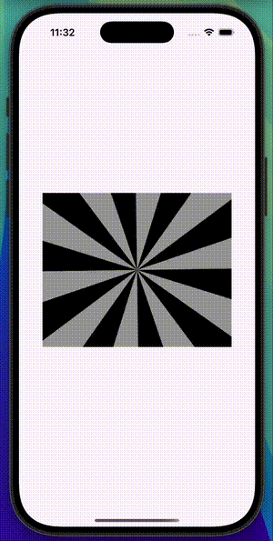

# Masked Motion

Masked Motion, Flutter kullanılarak geliştirilmiş, ortasında sabit bir dikdörtgen maskesi bulunan ve arka planda dönen üçgen desenli animasyonlu bir kullanıcı arayüzü bileşenidir.

## 🚀 Özellikler
- 🌀 **Dönen Arka Plan:** Sürekli dönen üçgen desenleri.
- 🎭 **Maske Efekti:** Ortada sabit bir dikdörtgen alanın maske olarak kullanılması.
- 🎨 **Özelleştirilebilir Tasarım:** Arka plan animasyonunun hızı ve renkleri kolayca değiştirilebilir.
- ⚡ **Hafif ve Performanslı:** AnimationController kullanılarak optimize edilmiş animasyon.

## 📸 Ekran Görüntüsü



## 🛠 Kurulum ve Kullanım

Bu projeyi çalıştırmak için aşağıdaki adımları takip edebilirsiniz:

### 1️⃣ Gerekli Bağımlılıkları Yükleyin
Flutter ortamının kurulu olduğundan emin olun. Daha sonra terminalde aşağıdaki komutu çalıştırarak bağımlılıkları yükleyin:

```sh
flutter pub get
```

### 2️⃣ Uygulamayı Çalıştırın
Aşağıdaki komut ile uygulamayı başlatabilirsiniz:

```sh
flutter run
```

## 📂 Proje Yapısı

```
masked_motion/
│── lib/
│   │── main.dart  # Ana uygulama dosyası
│   │── masked_rotating_background.dart  # Animasyon bileşeni
│── pubspec.yaml  # Bağımlılık yönetimi
│── README.md  # Proje dokümantasyonu
```

## ✨ Kullanılan Teknolojiler
- **Flutter** – Mobil uygulama geliştirme için.
- **Dart** – Flutter projeleri için kullanılan programlama dili.

## 📌 Geliştirme
Projeye katkıda bulunmak isterseniz, lütfen aşağıdaki adımları izleyin:

1. **Bu repoyu forklayın**
2. **Yeni bir branch oluşturun:** `git checkout -b yeni-ozellik`
3. **Değişikliklerinizi yapın ve commit edin:** `git commit -m 'Yeni özellik eklendi'`
4. **Branch'inizi push edin:** `git push origin yeni-ozellik`
5. **Pull Request (PR) oluşturun**

## 📜 Lisans
Bu proje [MIT Lisansı](LICENSE) kapsamında lisanslanmıştır.

---
Bu proje hakkında herhangi bir sorunuz varsa, lütfen bir issue açarak bizimle iletişime geçin! 😊

